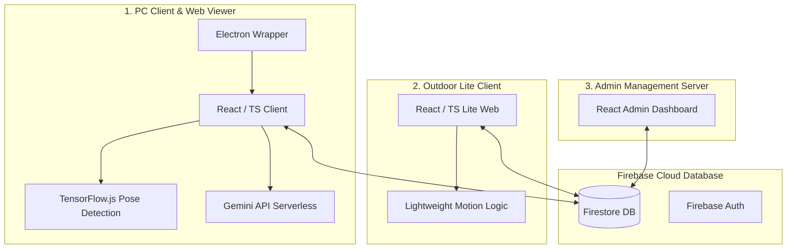
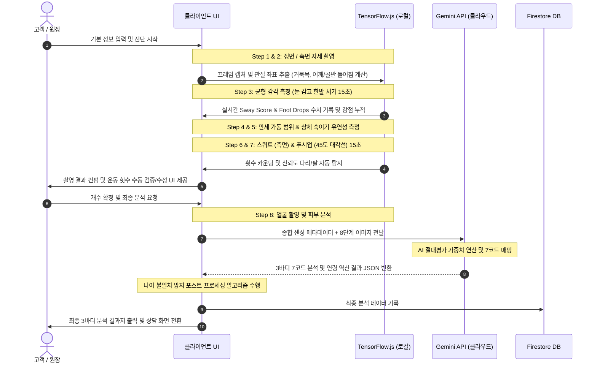

<!-- 역할: 개발자 미팅을 위한 BTC 3바디 AI분석기 전체 개발 계획서 및 프로세스 플로우 문서 -->
# 🏆 BTC 3바디 AI분석기 전체 개발 계획서 및 프로세스 플로우

이 문서는 'BTC 3바디 AI분석기'의 전체 시스템 아키텍처, 기능별 개발 플로우, 핵심 알고리즘 및 데이터베이스, 호스팅 환경을 정리한 공식 개발 계획서입니다. 개발자 미팅 및 아키텍처 검토 자료로 활용합니다.

---

## 1. 프로젝트 개요 및 비즈니스 목적

'BTC 3바디 AI분석기'는 사용자의 움직임과 자세, 생체 역학적 데이터를 컴퓨터 비전(TensorFlow.js)과 LLM(Gemini API)을 활용해 실시간으로 측정하고 분석하는 통합 건강 진단 시스템입니다. 

- **핵심 사상**: 단순한 체형 측정을 넘어, 신체(Body), 마음(Mind), 뇌(Brain)의 3바디 통합 건강 상태를 측정합니다.
- **연계 솔루션**: 측정 결과를 기반으로 7코드 에너지 흐름의 정체 구간을 파악하고 광명 차크라 특별 수련 프로그램을 동적으로 연계 및 추천합니다.

---

## 2. 시스템 아키텍처 및 기술 스택

본 프로젝트는 데이터베이스 스키마를 공유하면서 배포 환경과 목적에 따라 세 가지 서브시스템으로 철저하게 격리되어 운영됩니다.



### 2.1. 세부 서브시스템 명세
1. **PC Client (지점 키오스크용 데스크톱 앱)**
   - **기술 스택**: Electron, React, TypeScript, Vite, Tailwind CSS, TensorFlow.js (WebGL/WASM), @google/genai
   - **배포 환경**: Github Auto-Update 기능이 내장된 Windows 패키징 (NSIS 빌드) 및 Vercel Web Viewer (`btc-3body-ai-v2.vercel.app`)
2. **Outdoor Lite Client (야외 행사용 경량 웹 앱)**
   - **기술 스택**: React, TypeScript, Vite, Tailwind CSS, Lightweight Sensor Interface
   - **배포 환경**: Vercel 배포 (`btc-3body-outdoor-lite.vercel.app`)
   - **특징**: 네트워크 환경이 열악한 야외 행사를 위해 WebGL 연산 부하를 줄인 경량화 버전
3. **Admin Management Server (본사 통합 관리 대시보드)**
   - **기술 스택**: HTML/JS, Firebase Admin SDK
   - **배포 환경**: Vercel 배포 (`btc-admin-server.vercel.app`)
   - **주요 기능**: 전 지점 라이센스 관리, 사용자 피드백 통계 집계, 전국 지점별 점검 현황 실시간 모니터링

### 2.2. 웹 호스팅 및 배포 파이프라인 (Hosting & Deployment)
모든 호스팅 환경은 무중단 실시간 배포 인프라를 지향하며, GitHub 저장소 연동을 통한 CD(지속적 배포) 파이프라인으로 구축되어 있습니다.

- **호스팅 플랫폼**: Vercel
  - 최적의 전송 속도를 보장하기 위해 글로벌 CDN 배포망을 사용합니다.
  - 빌드 캐싱 기술을 적용해 프론트엔드 에셋 컴파일 및 로딩 속도를 향상했습니다.
- **배포 파이프라인**: GitHub Webhook Trigger
  - 리포지토리명: `EungiBang/body_aging_test`
  - 배포 흐름: 각 프로젝트 디렉터리(`BT 3바디 ai테스트`, `BT_3Body_Outdoor_Lite`, `BTC_Admin_Server`)별로 특정 브랜치에 커밋 푸시 시 Vercel에서 즉시 트리거되어 빌드 후 프로덕션 도메인에 롤아웃됩니다.
- **데스크톱 배포 및 업데이트**: GitHub Releases
  - Electron 빌더를 활용해 컴파일된 인스톨러(`.exe`) 파일을 GitHub Releases에 업로드합니다.
  - PC 클라이언트 실행 시 백그라운드에서 `electron-updater` 패키지가 GitHub 최신 릴리즈 버전을 확인하고 변경 분을 자동 백그라운드 다운로드 및 설치 패치합니다.

### 2.3. 🚨 개발자 크로스 체크 필수 규칙
PC 버전과 Outdoor Lite 버전은 완전히 다른 프로젝트 폴더로 분리되어 있으나 동일한 Firestore DB 구조와 비즈니스 도메인을 공유합니다. 따라서 다음 영역의 코드를 수정할 때는 반드시 양쪽 폴더의 소스코드를 동시 업데이트해야 합니다.
- **인증 및 라이센스 로직** (지점별 기기인증 및 Grace Period 처리)
- **Firebase Firestore 스키마 및 데이터 타입** (`types.ts` 파일 동기화 필수)
- **Gemini API 프롬프트 엔지니어링 및 Response JSON 구조**

---

## 3. 데이터베이스 아키텍처 및 보안 규칙 (Database & Security)

본 시스템은 Firebase 인프라를 활용하여 실시간 동기화와 오프라인 지원 기능이 탑재된 NoSQL 기반 데이터 아키텍처를 구현하고 있습니다.

### 3.1. Firestore 컬렉션 구조 및 스키마 명세

#### 1) `/users/{userId}` (지점 계정 정보)
- **용도**: 각 지점 원장님 및 본사 관리자 계정 메타데이터.
- **스키마 구조**:
```json
{
  "uid": "string (Firebase Auth UID)",
  "email": "string (지점 관리 이메일)",
  "displayName": "string (지점명 혹은 원장 이름)",
  "role": "string ('admin' | 'user')"
}
```

#### 2) `/members/{memberId}` (회원 진단 정보 기록)
- **용도**: 각 지점에서 측정한 회원의 인적사항, 8단계 촬영 이미지 및 AI 통합 진단 결과지.
- **스키마 구조**:
```json
{
  "id": "string (고유 UUID)",
  "name": "string (회원 이름)",
  "lastTestDate": "string (ISO 8601 타임스탬프 문자열)",
  "ownerUid": "string (해당 레코드를 생성한 지점의 Auth UID)",
  "sourceType": "string ('PC' | 'LITE')",
  "images": [
    {
      "step": "string (예: 'step1', 'step6')",
      "dataUrl": "string (Base64 형식의 캡처 이미지 데이터)",
      "reps": "number (선택사항, 해당 단계 스쿼트/푸시업 횟수)",
      "duration": "number (선택사항, 측정 진행 시간)"
    }
  ],
  "report": {
    "id": "string",
    "date": "string (ISO 8601)",
    "userInfo": {
      "name": "string",
      "gender": "string ('male' | 'female' | 'other')",
      "age": "number"
    },
    "physicalAge": "number (종합 점수로 역산된 신체 나이)",
    "faceAgeEstimate": "number (안면 피부로 분석된 예측 나이)",
    "overallScore": "number (100점 만점의 3바디 종합 점수)",
    "summary": "string (AI 종합 평가 요약문)",
    "brainHealthImplication": "string (신체 움직임과 연결된 뇌 건강 해석)",
    "postureMetrics": [
      {
        "name": "string (예: '거북목', '골반 비대칭')",
        "status": "string ('Good' | 'Fair' | 'Poor')",
        "description": "string (개별 자세 설명)",
        "score": "number"
      }
    ],
    "strengthMetrics": [
      {
        "exercise": "string (예: 'Squat', 'Pushup')",
        "reps": "number (확정된 최종 횟수)",
        "performance": "string (평균 대비 수행 능력 정보)",
        "formScore": "number (관절 안정성 및 자세 점수)",
        "recommendation": "string"
      }
    ],
    "agingMetrics": [
      {
        "testName": "string (예: '균형 감각')",
        "result": "string (예: 'Foot Drops 1회, Sway Score 15')",
        "score": "number"
      }
    ],
    "faceAnalysis": {
      "wrinkles": "string",
      "elasticity": "string",
      "summary": "string",
      "recommendation": "string"
    },
    "recommendations": {
      "meditation": "string (추천 차크라 명세)",
      "gymnastics": "string (추천 활공/도인 체조)",
      "brainTraining": "string (추천 두뇌 트레이닝 게임)"
    }
  }
}
```

#### 3) `/branches/{branchId}` (지점별 라이센스 및 한도 통제)
- **용도**: 지점별 결제 및 라이센스 상태, 기능 한도를 원격 제어합니다.
- **스키마 구조**:
```json
{
  "name": "string (지점명)",
  "kfaceDailyLimit": "number (관상 분석 일일 한도 수치)",
  "ktarotDailyLimit": "number (타로 분석 일일 한도 수치)",
  "licenseExpired": "boolean (라이센스 만료 차단 여부)"
}
```

#### 4) `/system_settings/config` (글로벌 릴리즈 및 보안 환경 설정)
- **용도**: 버전 관리 및 배포 버전의 사용 인가 코드 관리.
- **스키마 구조**:
```json
{
  "autoApproveCode": "string (PC/Admin 앱 배포 승인용 패스코드)",
  "liteAutoApproveCode": "string (Lite 웹 앱 배포 승인용 패스코드)"
}
```

### 3.2. Firestore 보안 규칙 (Security Rules)
개인정보 유출과 타 지점의 데이터 불법 변조를 강력히 차단하기 위해 엄격한 데이터 액세스 보안 룰을 고수합니다.

- **비인증 사용자 접근 차단**: 로그인하지 않은 외부 클라이언트의 읽기/쓰기 권한은 원천적으로 금지됩니다.
- **지점 간 데이터 완전 격리**: 
  - 각 지점 사용자는 본인이 직접 생성한 회원 문서만 열람 및 편집할 수 있습니다.
  - 검증 공식: `resource.data.ownerUid == request.auth.uid`
- **본사 관리자 만능 권한(Superuser Access)**:
  - 본사 관리자(`role == 'admin'` 또는 특정 지정 관리자 이메일 `bangeg74@gmail.com`)는 모든 문서를 읽고 쓰고 삭제할 권한을 지닙니다.
- **엄격한 데이터 유효성 검증(Schema Validation)**:
  - 데이터 생성 및 수정 시 날짜 포맷이 올바른지, `name` 필드의 글자 수가 가이드라인을 통과하는지, 촬영 이미지 배열 개수가 20개 이하인지 등 스키마 정합성을 DB 레벨에서 2차 검증합니다.

---

## 4. 8단계 진단 시퀀스 및 프로세스 플로우

고객이 진단 영역에 진입하여 결과를 얻기까지의 실시간 프로세스 플로우는 다음과 같습니다.



### 4.1. 단계별 개발 상세 규격

| 단계 | 측정 항목 | 센싱 방식 | 하드웨어 구도 및 가이드 UI | 핵심 개발 및 탐지 로직 |
| :--- | :--- | :--- | :--- | :--- |
| **Step 1** | 정면 자세 | 정적 캡처 (5초 대기) | 정면 전신 (어깨, 골반 정렬선 표시) | 관절 랜드마크 좌우 어깨/골반 Y축 편차 계산 |
| **Step 2** | 측면 자세 | 정적 캡처 (5초 대기) | 측면 전신 (수직 plumb line 표시) | 귀-어깨-골반-가장자리 정렬 분석 (거북목 각도 측정) |
| **Step 3** | 균형 감각 | 동적 실시간 센싱 (15초) | 정면 (발목 트래킹 박스 표시) | 양발 Y좌표 편차로 Foot Drop 탐지, Nose 이동 픽셀로 Sway Score 계산 |
| **Step 4** | 가동 범위 | 정적 캡처 (만세 동작) | 정면 전신 (상한 가동 범위 가이드) | 양팔 들어 올리기 시 견관절 각도 및 좌우 높이 차 측정 |
| **Step 5** | 유연성 | 정적 캡처 (상체 숙이기) | 측면 전신 (유연성 타겟 박스) | 무릎의 굽힘 신뢰도 판별 및 척추-고관절 굴곡 각도 계산 |
| **Step 6** | 스쿼트 | 동적 실시간 센싱 (15초) | **완전 측면 (Side-View)** (엉덩이 타겟 박스) | 신뢰도 점수가 높은 다리를 기준 다리로 자동 판별. `angle < 110` Down, `angle > 150` Up 판정 |
| **Step 7** | 푸시업 | 동적 실시간 센싱 (15초) | **대각선 45도 (Diagonal)** (대각 3D 면 가이드) | 신뢰도가 가장 높은 팔 기준 센싱. 일반인 기준 고려 완화 판정 (`angle < 120` Down, `angle > 140` Up) |
| **Step 8** | 얼굴 나이 | 정적 캡처 (클로즈업) | 안면 타겟 서클 가이드 | 안면 윤곽 및 눈가/입가 주름, 피부 톤 대조 분석 |

---

## 5. 핵심 기술 구현 및 연산 공식

### 5.1. WebGL 메모리 누수 방지 (VRAM 관리)
TensorFlow.js Pose Detection 구동 시 VRAM 누수로 브라우저가 정지하는 현상을 차단하기 위한 필수 아키텍처 공식입니다.
- **해결 방안**: WebGL 텍스처 임계값 강제 비우기를 설정하고 프레임 단위로 엔진 스코프를 완전히 정리합니다.
```typescript
// 1. WebGL VRAM 텍스처 즉시 초기화 설정
try {
    tf.env().set('WEBGL_DELETE_TEXTURE_THRESHOLD', 0);
} catch (e) {
    console.error("WebGL threshold config failed", e);
}

// 2. 프레임 연산 주기마다 스코프 관리 강제화
async function estimateFramePose(offCanvas: HTMLCanvasElement) {
    tf.engine().startScope();
    try {
        const poses = await globalDetector.estimatePoses(offCanvas);
        return poses;
    } finally {
        tf.engine().endScope(); // 사용된 메모리 즉시 해제
    }
}
```

### 5.2. 부정 행위 방지 (Cheat Prevention) 로직
사용자가 사진 촬영 순간에만 정상 자세를 취해 AI를 속이는 현상을 차단하기 위해, 로컬에서 15초간의 물리 데이터를 미리 계측하여 AI 서비스에 메타데이터로 전달합니다.
- **Foot Drop (발 디딤) 계산**:
  $$\text{Ankle\_diff} = |y_{\text{left\_ankle}} - y_{\text{right\_ankle}}|$$
  $$\text{Shoulder\_width} = |x_{\text{left\_shoulder}} - x_{\text{right\_shoulder}}|$$
  $$\text{If } \text{Ankle\_diff} < 0.4 \times \text{Shoulder\_width} \implies \text{Foot Drop 발생 (바닥 디딤 판정)}$$
- **Sway Score (상체 요동도) 계산**:
  $$\text{Sway} = \sum_{t=1}^{T} |x_{\text{nose}, t} - x_{\text{nose}, t-1}|$$
  Sway 누적치가 임계값(50px)을 초과할 경우 흔들림 경고 등급을 상향 조정하여 Gemini API 프롬프트에 `footDrops`와 `swayScore`를 메타데이터로 전달합니다.

### 5.3. 종합 점수 및 신체 나이 역산 시스템
AI가 임의로 나이를 생성하여 발생하는 일관성 훼손을 차단하기 위해 하드코딩된 물리 데이터 채점 시스템을 적용합니다.

1. **개별 항목 절대 평가**:
   - **스쿼트 / 푸시업**: 성별/연령대 평균 대비 달성율로 100점 만점 환산 (평균 달성 시 70점, 상위 10% 달성 시 100점).
   - **균형 감각**: Foot Drops(횟수)와 Sway Score(점수) 매트릭스 테이블 매핑 채점.
   - **자세/유연성**: 프롬프트 상에 엄격 채점 룰(평균 60~70점 부여 가이드) 주입.
2. **종합 점수 가중치 공식**:
   $$\text{Overall Score} = (\text{Squat} \times 0.20) + (\text{Pushup} \times 0.15) + (\text{Balance} \times 0.25) + (\text{Posture} \times 0.20) + (\text{Flexibility} \times 0.10) + (\text{ArmRaise} \times 0.10)$$
3. **최종 신체 나이 환산 공식**:
   - 종합 점수 **70점**을 실제 나이와의 편차 **0살**로 정의합니다.
   - **1점 편차당 0.4살**을 가감합니다. (최대 -12살 ~ +20살 방어선 적용)
   $$\text{Physical Age} = \text{Real Age} + (70 - \text{Overall Score}) \times 0.4$$

---

## 6. 향후 개발 로드맵 및 관리 규칙

1. **뇌 테스트 (Brain Test) 복구 및 최적화**
   - 향후 인지 검사 및 뇌기능 테스트 모듈 복구 시, Step 3의 WebGL 최적화 공식을 반드시 이식해 장시간 구동 환경에서의 크래시를 방지할 계획입니다.
2. **기기 종속 라이센스 검증 강화**
   - `node-machine-id` 모듈을 활용하여 최초 구동 시 메인보드 UUID 인증 절차를 강화하고, 본사 Admin Server에서 원격 라이센스 만료 및 강제 정지 처리가 실시간으로 연동되도록 라이센스 통제 시스템 고도화를 진행합니다.
3. **분석 엔진 일관성 유지**
   - 추가적인 바이오센서 데이터나 신규 측정 모듈을 확장하더라도 AI가 나이를 임의 계산하지 않도록 절대 평가 1차 환산 후 종합 역산 구조를 유지할 것입니다.
